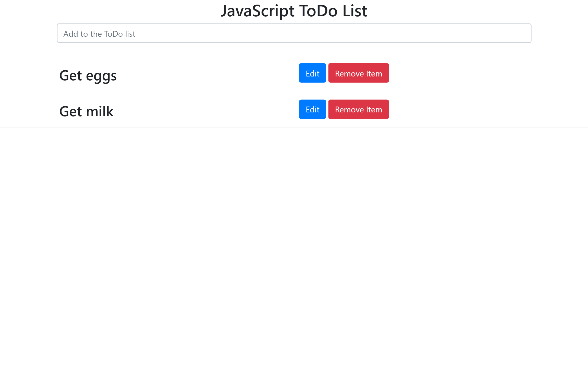
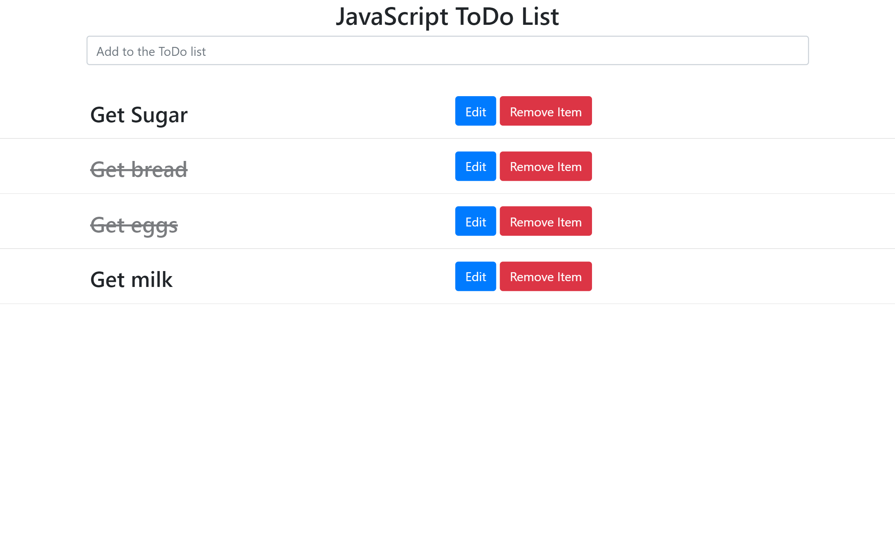

# ToDo_List_JS_Example
A ToDo List web application that uses JavaScript arrays to add, remove, edit and check items off a ToDo List. Uses localStorage to keep track of all the ToDo items in the array even after the browser has been refreshed. The design was built around Bootstrap 4. 

<strong>Screenshot One:</strong>

  

<strong>Screenshot Two:</strong>

  

<strong>Screenshot Three:</strong>

  

